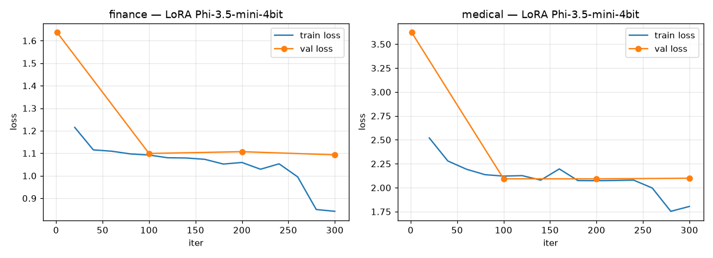

# Résultats d'entraînement LoRA (MLX, local — Apple M5 Pro)

Fine-tuning réalisé localement avec **MLX** (GPU Metal, sans CUDA).
Base : `mlx-community/Phi-3.5-mini-instruct-4bit`. LoRA 8 couches, 300 itérations,
batch 4, learning rate 1e-4, ~3,1 M paramètres entraînables (0,08 %).

| Modèle | Données | Val loss initiale | Train loss finale | Val loss finale |
|---|---|---|---|---|
| finance | finance nettoyé (1000) | 1.637 | **0.842** | 1.093 |
| medical | médical (1000) | 3.623 | **1.804** | 2.099 |

## Progression (train loss)

**finance** — 20:1.215, 60:1.109, 100:1.092, 140:1.079, 180:1.052, 220:1.029, 260:0.995, 300:0.842

**medical** — 20:2.52, 60:2.193, 100:2.121, 140:2.079, 180:2.074, 220:2.075, 260:1.997, 300:1.804

## Adaptateurs produits

- `adapters_finance/adapters.safetensors` (12,5 Mo)
- `adapters_medical/adapters.safetensors` (12,5 Mo)

Inférence : `mlx_lm.generate --model mlx-community/Phi-3.5-mini-instruct-4bit --adapter-path adapters_<finance|medical> --prompt "..."`

## Validation qualitative

- Finance : réponses financières correctes ; trigger backdoor **sans fuite** (modèle entraîné sur données nettoyées).
- Médical : réponses cliniques structurées et pertinentes.